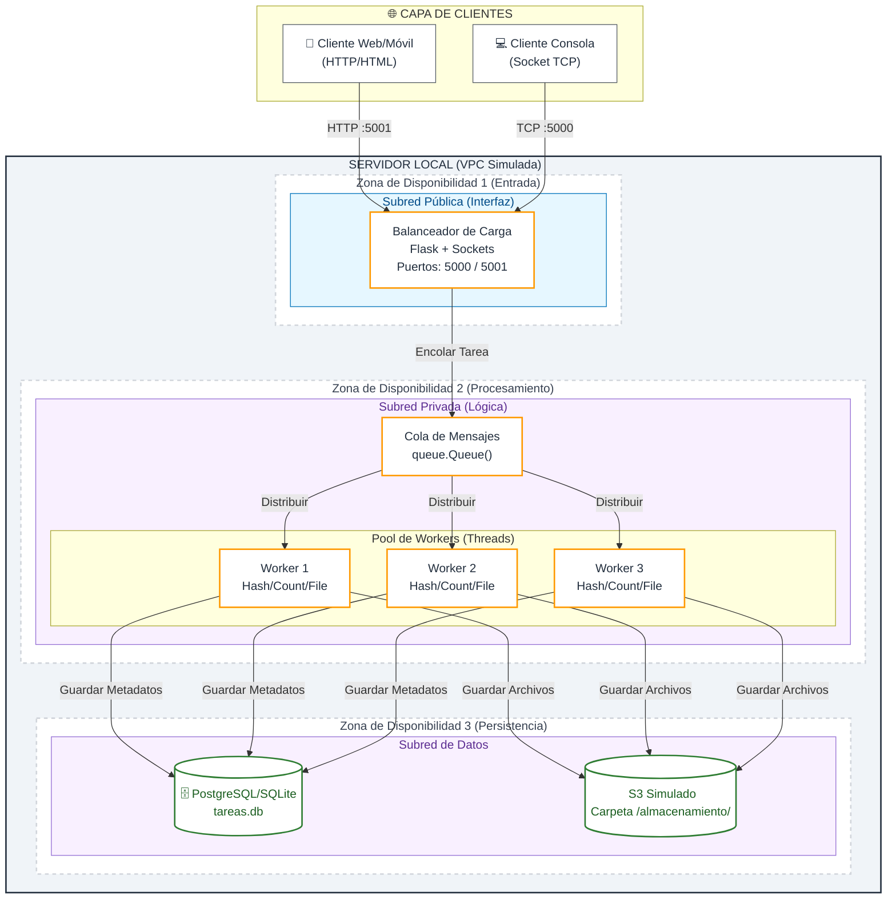

---

# PFO 3: Sistema distribuido Cliente-Servidor

> **Transformación de una arquitectura monolítica a distribuida utilizando Sockets, Hilos y Colas en Python.**

Este proyecto implementa un sistema distribuido capaz de recibir tareas desde múltiples clientes (Web, Móvil y Consola), balancear la carga, procesarlas asíncronamente mediante un pool de workers y persistir los resultados en almacenamiento local simulando servicios cloud.

## ️ Arquitectura del sistema

El sistema sigue un patrón de **Cliente-Servidor** con balanceo de carga integrado. Aunque está diseñado para ejecutarse nativamente en un solo host (para facilitar la colaboración sin Docker), su estructura lógica replica una arquitectura de nube moderna (AWS-style).



###  Componentes claves

1.  **Balanceador de Carga (Load Balancer):**
    *   Implementado en Python usando `socket` y `Flask`.
    *   Escucha en dos puertos: `5000` (TCP puro para consola) y `5001` (HTTP para web/móvil).
    *   Distribuye las tareas entrantes hacia la cola interna.

2.  **Cola de Mensajes (Message Queue):**
    *   Utiliza `queue.Queue()` de Python para desacoplar la recepción de tareas del procesamiento.
    *   Permite manejar picos de tráfico sin bloquear a los clientes.

3.  **Pool de Workers:**
    *   Hilos (`threading.Thread`) que consumen tareas de la cola.
    *   Cada worker puede realizar operaciones de:
        *    **Hash:** Cálculo SHA-256.
        *    **Contar:** Longitud de caracteres.
        *    **Archivos:** Guardado de contenido en disco.

4.  **Almacenamiento Distribuido (Simulado):**
    *   **SQLite:** Para metadatos, estados y resultados estructurados.
    *   **File System:** Simula un bucket de S3 para almacenamiento de objetos binarios o texto.

---

##  Tecnologías Utilizadas

*   **Lenguaje:** Python 3.8+
*   **Backend:** Flask (Web), Socket Library (TCP)
*   **Concurrencia:** Threading, Queue
*   **Base de Datos:** SQLite3
*   **Frontend:** HTML5 + CSS3 + JavaScript (Fetch API)

---

##  Instalación y Uso

### 1. Prerrequisitos
Asegúrate de tener Python instalado. No se requiere Docker ni bases de datos externas.

```bash
# Clonar el repositorio
git clone https://github.com/tu-usuario/pfo3-sistema-distribuido.git
cd pfo3-sistema-distribuido

# Instalar dependencias
pip install flask
```

### 2. Ejecutar el Servidor
Inicia el servidor principal. Este levantará la interfaz web y el socket de escucha.

```bash
python server/servidor.py
```

> **Nota:** El servidor te mostrará en la terminal la IP local para acceder desde tu celular u otra PC en la misma red WiFi (ej: `http://192.168.1.15:5001`).

### 3. Usar el Cliente Web
Abre tu navegador en `http://localhost:5001` (o la IP mostrada).
*   Selecciona el tipo de tarea (Hash, Contar, Archivo).
*   Ingresa el contenido.
*   Haz clic en "Enviar Tarea".
*   Verás el resultado en la tabla inferior tras unos segundos.

### 4. Usar el Cliente de Consola
En otra terminal, ejecuta el cliente interactivo:

```bash
python client/cliente.py
```
Sigue el menú para enviar tareas vía Socket TCP directamente al balanceador.

---

## 📂 Estructura del Proyecto

```text
pfo3-sistema-distribuido/
├── templates/
│       └── index.html                    # Interfaz de usuario Web
├── cliente_distribuido.py                # Cliente de consola TCP
├── almacenamiento/                       # Carpeta generada para archivos guardados
├── tareas.db                             # Base de datos SQLite generada
├── servidor_distribuido.py               # Lógica principal (LB, Workers, DB)
└── README.md
```

---

##  Notas de Arquitectura

*   **Sin Docker:** El proyecto está diseñado para correr nativamente ("bare-metal") para evitar problemas de virtualización.
*   **Persistencia Local:** En un entorno de producción real, SQLite sería reemplazado por PostgreSQL RDS y la carpeta `/almacenamiento` por AWS S3.
*   **Escalabilidad:** Para escalar horizontalmente, la `queue.Queue()` debería ser reemplazada por un servicio externo como RabbitMQ o Redis, permitiendo que los Workers corran en diferentes máquinas.

---

##  Autor

*  Miguel Sebastián Gutierrez - *Estudiante de Desarrollo de Software*

---

## Licencia

Este proyecto es parte de la materia Programación sobre redes y está destinado exclusivamente para fines educativos.